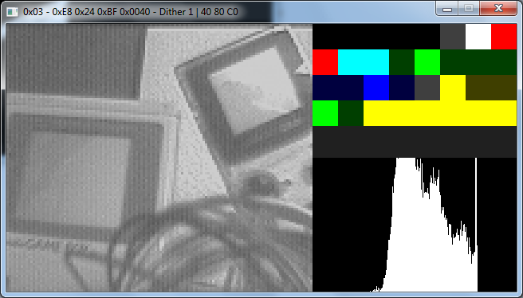

# Game Boy Camera RE
Documentation about GB Camera and tools used to reverse engineer it by using Arduino UNO (and Arduino DUE for a few things about timing).

By Antonio Niño Díaz (AntonioND)

[https://github.com/AntonioND/gbcam-rev-engineer](https://github.com/AntonioND/gbcam-rev-engineer)

